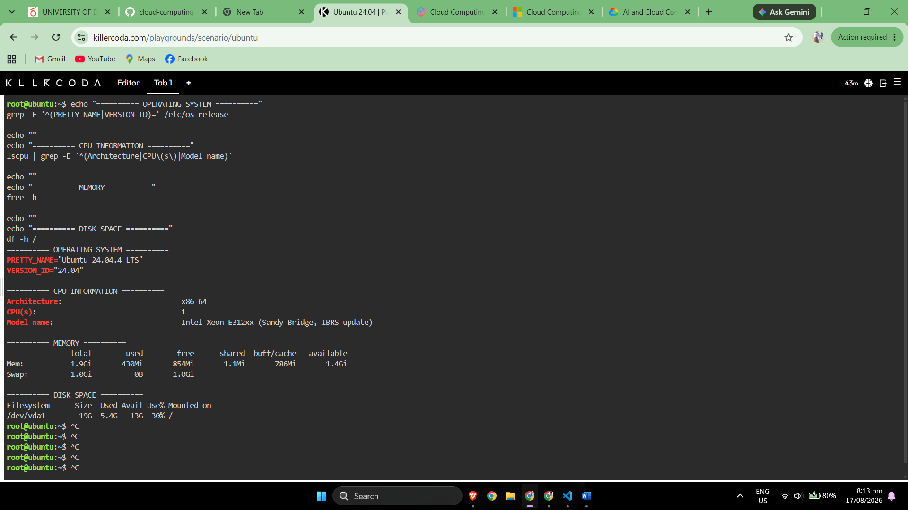

# Linux Investigation

## Objective

A Linux environment was launched using KillerCoda. Linux commands were used to identify the operating system, processor information, available memory, and disk capacity. The collected information was then related to equivalent virtual-machine services available from AWS, Microsoft Azure, and Google Cloud.

---

## Commands Used

### Operating System

```bash
grep -E '^(PRETTY_NAME|VERSION_ID)=' /etc/os-release
```

### CPU Information

```bash
lscpu | grep -E '^(Architecture|CPU\(s\)|Model name)'
```

### Memory Information

```bash
free -h
```

### Disk Space

```bash
df -h /
```

---

# Linux Server Information

**Operating System**
```text
PRETTY_NAME="Ubuntu 24.04.4 LTS"
VERSION_ID="24.04"
```

**CPU Information**
```text
Architecture:                            x86_64
CPU(s):                                  1
Model name:                              Intel Xeon E312xx (Sandy Bridge, IBRS update)
```

**Memory**
```text
               total        used        free      shared  buff/cache   available
Mem:           1.9Gi       430Mi       854Mi       1.1Mi       786Mi       1.4Gi
Swap:          1.0Gi          0B       1.0Gi
```

**Disk Space**
```text
Filesystem      Size  Used Avail Use% Mounted on
/dev/vda1        19G  5.4G   13G  30% /
```

---

# Terminal Evidence



---

# Cloud Migration Analysis

## Question

If this Linux server were migrated to the cloud, which AWS, Azure, and GCP services could host it?

## Amazon Web Services

The Linux server could be migrated to **Amazon Elastic Compute Cloud (Amazon EC2)**. Amazon EC2 provides configurable virtual machines called instances and supports Linux operating systems. An appropriate EC2 instance type could be selected according to the CPU, memory, storage, and networking requirements identified during the KillerCoda investigation.

## Microsoft Azure

The Linux server could be migrated to **Azure Virtual Machines**. Azure Virtual Machines supports Linux and Windows virtual machines and allows organizations to select VM sizes according to processor, memory, storage, networking, and application requirements.

## Google Cloud Platform

The Linux server could be migrated to **Google Compute Engine**. Compute Engine provides configurable virtual machines and supports Linux workloads. A suitable machine configuration could be selected according to the CPU, memory, disk, network, and application requirements of the server.

---

# Cloud VM Service Comparison

| Cloud Provider | Service That Could Host the Linux Server |
|---|---|
| **AWS** | Amazon Elastic Compute Cloud (Amazon EC2) |
| **Microsoft Azure** | Azure Virtual Machines |
| **Google Cloud Platform** | Compute Engine |

All three services provide cloud-based virtual machines capable of hosting a Linux operating system. The final platform and machine size would depend on the server's actual CPU, memory, storage, performance, geographic, availability, security, and cost requirements.

---

# References

[KillerCoda – Interactive Environments](https://killercoda.com/)  
[Amazon Web Services – Amazon EC2](https://aws.amazon.com/ec2/)  
[Microsoft Azure – Azure Virtual Machines](https://azure.microsoft.com/en-us/products/virtual-machines/)  
[Google Cloud – Compute Engine](https://cloud.google.com/products/compute)  
[GitHub Docs – About READMEs](https://docs.github.com/en/repositories/managing-your-repositorys-settings-and-features/customizing-your-repository/about-readmes)  
[Visual Studio Code – Source Control Quickstart](https://code.visualstudio.com/docs/sourcecontrol/quickstart)  