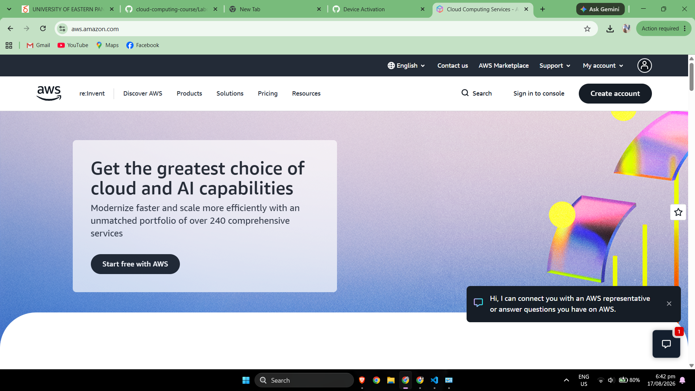

# Amazon Web Services (AWS) Research

## Brief Overview

Amazon Web Services (AWS) is a cloud computing platform provided by Amazon. AWS was launched in 2006 and provides cloud-based computing, storage, networking, databases, security, analytics, artificial intelligence, serverless computing, and many other technology services. Organizations can use AWS resources on demand instead of purchasing and maintaining all physical infrastructure themselves. [1]

AWS is widely used for hosting websites and applications, storing data, operating enterprise systems, running databases, building cloud-native applications, and supporting large-scale computing workloads.

---

## Global Infrastructure

AWS organizes its global infrastructure into **Regions** and **Availability Zones**. A Region represents a geographic area, while Availability Zones are separate infrastructure locations within a Region. This design allows organizations to distribute applications across multiple locations to improve availability, reliability, and disaster recovery. [2]

Customers can select AWS Regions according to requirements such as application latency, regulatory requirements, data residency, service availability, and disaster-recovery strategy.

---

## Cloud Management Console

The **AWS Management Console** is a browser-based graphical interface used to access and manage AWS resources. Through the console, administrators and developers can create virtual machines, configure storage, manage networking, control permissions, monitor resources, and access AWS services. [3]

AWS also provides command-line and programmatic management options, including the AWS Command Line Interface and APIs.

---

## Four Core Services

### 1. Amazon Elastic Compute Cloud (Amazon EC2)

Amazon EC2 provides resizable virtual computing capacity in AWS. It allows users to create and operate virtual servers called EC2 instances. Organizations can select instance configurations according to their CPU, memory, storage, operating system, and workload requirements. [4]

### 2. Amazon Simple Storage Service (Amazon S3)

Amazon S3 is an object-storage service designed for storing and retrieving data. It can be used for backups, website content, application files, data archives, logs, media files, and data-lake workloads. [5]

### 3. Amazon Virtual Private Cloud (Amazon VPC)

Amazon VPC enables organizations to create logically isolated virtual networks in AWS. Users can configure subnets, IP address ranges, routing, gateways, and security controls for cloud resources. [6]

### 4. AWS Identity and Access Management (IAM)

AWS IAM helps administrators securely control access to AWS resources. Organizations can create users, roles, and policies and define which actions identities are permitted to perform. [7]

---

## Three Advantages of AWS

### 1. Broad Range of Cloud Services

AWS provides a large portfolio of services covering compute, storage, databases, networking, security, analytics, containers, serverless computing, artificial intelligence, and other enterprise technologies.

### 2. Global and Highly Available Infrastructure

AWS Regions and Availability Zones allow organizations to deploy workloads across different infrastructure locations. This can help support high availability, redundancy, and disaster-recovery designs.

### 3. Scalability and Flexibility

AWS resources can be increased or decreased as application requirements change. Organizations can therefore build systems that support both small workloads and applications that experience significant growth.

---

## Typical Enterprise Use Cases

Typical enterprise uses of AWS include:

- Hosting websites and enterprise applications
- Running virtual machines
- Building mobile and web application backends
- Storing backups and business data
- Running relational and NoSQL databases
- Disaster recovery and business continuity
- Containerized application deployment
- Serverless application development
- Data analytics and machine learning
- Global e-commerce applications

---

## Screenshot Evidence

---

## References

[Amazon Web Services – Our Origins](https://aws.amazon.com/about-aws/our-origins/)  
[Amazon Web Services – Regions and Availability Zones](https://aws.amazon.com/about-aws/global-infrastructure/regions_az/)  
[AWS Documentation – What is the AWS Management Console?](https://docs.aws.amazon.com/awsconsolehelpdocs/latest/gsg/what-is.html)  
[Amazon Web Services – Amazon EC2](https://aws.amazon.com/ec2/)  
[Amazon Web Services – Amazon S3](https://aws.amazon.com/s3/)  
[Amazon Web Services – Amazon VPC](https://aws.amazon.com/vpc/)  
[Amazon Web Services – AWS Identity and Access Management](https://aws.amazon.com/iam/)  