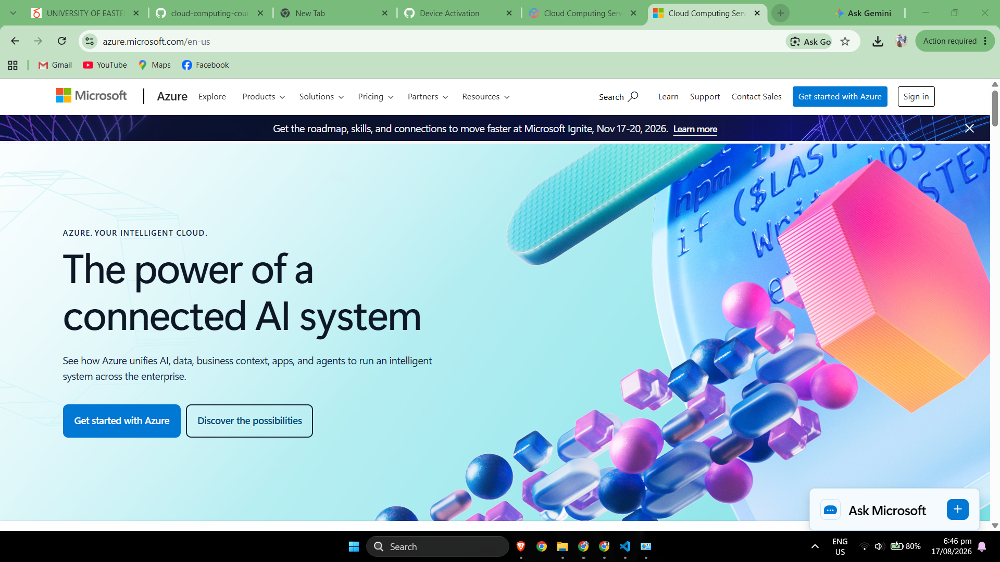

# Microsoft Azure Research

## Brief Overview

Microsoft Azure is Microsoft's cloud computing platform. It provides services for computing, storage, networking, databases, analytics, artificial intelligence, security, application development, and other enterprise workloads. Windows Azure became generally available in 2010 and was later renamed Microsoft Azure.

Azure is particularly useful to organizations that already use Microsoft technologies because it can support cloud, on-premises, and hybrid computing environments.

---

## Global Infrastructure

Microsoft Azure operates cloud infrastructure across geographic **Regions**. Azure also provides **Availability Zones** in supported regions. Availability Zones are physically separate groups of datacenters within a region and can be used to improve resilience and availability.

Organizations can select regions based on factors such as geographic location, service availability, data residency, compliance requirements, application performance, and business-continuity needs.

---

## Cloud Management Console

The **Azure portal** is Microsoft's browser-based interface for creating, configuring, and monitoring Azure resources. It allows users to manage virtual machines, storage, databases, networks, identities, security settings, and other cloud resources from a graphical interface.

Microsoft also provides Azure PowerShell, the Azure CLI, APIs, and infrastructure-as-code tools for automation.

---

## Four Core Services

### 1. Azure Virtual Machines

Azure Virtual Machines provides Infrastructure as a Service (IaaS) virtual machines. Organizations can deploy Windows or Linux virtual servers and select configurations according to workload CPU, memory, storage, and networking requirements.

### 2. Azure Blob Storage

Azure Blob Storage is Microsoft's object-storage service for storing large amounts of unstructured data such as documents, application files, images, videos, backups, archives, and logs.

### 3. Azure Virtual Network

Azure Virtual Network provides private networking capabilities for Azure resources. It allows organizations to create virtual networks and subnets and connect cloud resources to each other, the internet, or on-premises infrastructure.

### 4. Microsoft Entra ID

Microsoft Entra ID is Microsoft's cloud-based identity and access management service. It supports user identities, authentication, application access, security policies, and integration with Microsoft cloud services such as Microsoft 365.

---

## Three Advantages of Microsoft Azure

### 1. Strong Microsoft Ecosystem Integration

Azure integrates with Microsoft technologies used by many organizations, including Windows Server, Microsoft Entra ID, Microsoft 365, SQL technologies, and other Microsoft enterprise products.

### 2. Hybrid Cloud Capabilities

Azure provides technologies that help organizations connect and manage cloud and on-premises environments. This makes it useful for enterprises that cannot immediately move every workload entirely to the public cloud.

### 3. Wide Range of Enterprise Services

Azure provides services covering virtual machines, databases, storage, networking, containers, artificial intelligence, security, analytics, application development, and enterprise management.

---

## Typical Enterprise Use Cases

Typical Azure enterprise uses include:

- Migrating Windows Server workloads
- Hosting Windows and Linux virtual machines
- Hybrid cloud environments
- Microsoft identity integration
- Enterprise application hosting
- Managed SQL databases
- Backup and disaster recovery
- Web and mobile applications
- Kubernetes applications
- Artificial intelligence and analytics
- Cloud storage

---

## Screenshot Evidence

---

## References

[Microsoft – Windows Azure General Availability](https://blogs.microsoft.com/blog/2010/02/01/windows-azure-general-availability/)  
[Microsoft Learn – What are Azure regions?](https://learn.microsoft.com/en-us/azure/reliability/regions-overview)  
[Microsoft Learn – Azure Portal Quickstart Center](https://learn.microsoft.com/en-us/azure/azure-portal/azure-portal-quickstart-center)  
[Microsoft Azure – Virtual Machines](https://azure.microsoft.com/en-us/products/virtual-machines/)  
[Microsoft Learn – Introduction to Azure Blob Storage](https://learn.microsoft.com/en-us/azure/storage/blobs/storage-blobs-introduction)  
[Microsoft Learn – Azure Virtual Network](https://learn.microsoft.com/en-us/azure/virtual-network/virtual-networks-overview)  
[Microsoft Learn – What is Microsoft Entra ID?](https://learn.microsoft.com/en-us/entra/fundamentals/whatis)  