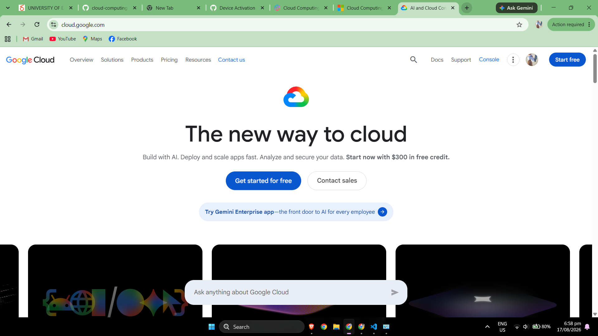

# Google Cloud Platform (GCP) Research

## Brief Overview

Google Cloud Platform (GCP), commonly referred to as Google Cloud, provides cloud computing services for virtual machines, storage, databases, networking, containers, data analytics, artificial intelligence, machine learning, and application development.

One of Google's earliest major public cloud services was Google App Engine, introduced in 2008. Google describes App Engine as one of the early investments whose technology became part of the broader Google Cloud Platform.

---

## Global Infrastructure

Google Cloud organizes its infrastructure into **Regions** and **Zones**. A region is an independent geographic area, while zones are deployment areas inside regions. Organizations can deploy applications across multiple zones or regions to improve resilience and serve users from appropriate geographic locations.

Region selection may depend on application latency, availability requirements, data-location requirements, pricing, and availability of particular Google Cloud services.

---

## Cloud Management Console

The **Google Cloud console** is a browser-based graphical interface used to create, configure, manage, and monitor Google Cloud resources. Users can manage virtual machines, storage, networks, Kubernetes clusters, databases, identity permissions, APIs, and other services using the console.

Google Cloud also provides the Google Cloud CLI, APIs, Cloud Shell, and infrastructure automation capabilities.

---

## Four Core Services

### 1. Compute Engine

Compute Engine provides Infrastructure as a Service virtual machines. Users can create Linux and Windows virtual machines and configure machine types, processors, memory, storage, networking, and other infrastructure settings.

### 2. Cloud Storage

Cloud Storage is Google's object-storage service. It can store data such as application files, backups, media, archives, logs, and data used by analytics or machine-learning workloads.

### 3. Virtual Private Cloud (VPC)

Google Cloud Virtual Private Cloud provides networking capabilities for cloud resources. It enables organizations to define virtual networks and connectivity for services and virtual machines.

### 4. Cloud Identity and Access Management (IAM)

Google Cloud IAM provides authorization and access control for Google Cloud resources. Administrators can grant predefined or custom roles to principals and control what actions they can perform on resources.

---

## Three Advantages of Google Cloud

### 1. Strong Artificial Intelligence and Machine Learning Capabilities

Google Cloud provides artificial intelligence and machine-learning services such as Vertex AI for developing and operating AI solutions.

### 2. Strong Kubernetes and Cloud-Native Technologies

Google created the technology that led to Kubernetes and provides Google Kubernetes Engine (GKE) as a managed Kubernetes platform. This makes GCP attractive for organizations building containerized and cloud-native applications.

### 3. Data Analytics and Global Infrastructure

Google Cloud combines global infrastructure with cloud data-processing, database, analytics, and AI technologies, making it suitable for applications that process large amounts of information.

---

## Typical Enterprise Use Cases

Typical GCP enterprise uses include:

- Artificial intelligence and machine learning
- Data analytics and large-scale data processing
- Kubernetes and containerized applications
- Linux and Windows virtual machines
- Web and mobile application hosting
- Object storage and backups
- Managed databases
- Cloud-native application development
- Research computing
- Globally distributed applications

---

## Screenshot Evidence

---

## References

[Google Cloud – Reflecting on Our Ten Year App Engine Journey](https://cloud.google.com/blog/products/gcp/reflecting-on-our-ten-year-app-engine-journey/)  
[Google Cloud Documentation – Geography and Regions](https://docs.cloud.google.com/docs/geography-and-regions)  
[Google Cloud Documentation – Google Cloud Console](https://docs.cloud.google.com/compute/docs/console)  
[Google Cloud – Compute Engine](https://cloud.google.com/products/compute)  
[Google Cloud – Cloud Storage](https://cloud.google.com/storage)  
[Google Cloud – Virtual Private Cloud](https://cloud.google.com/vpc)  
[Google Cloud Documentation – Identity and Access Management](https://cloud.google.com/iam/docs/overview)  
[Google Cloud – Google Kubernetes Engine](https://cloud.google.com/kubernetes-engine)  
[Google Cloud – Vertex AI](https://cloud.google.com/vertex-ai)  